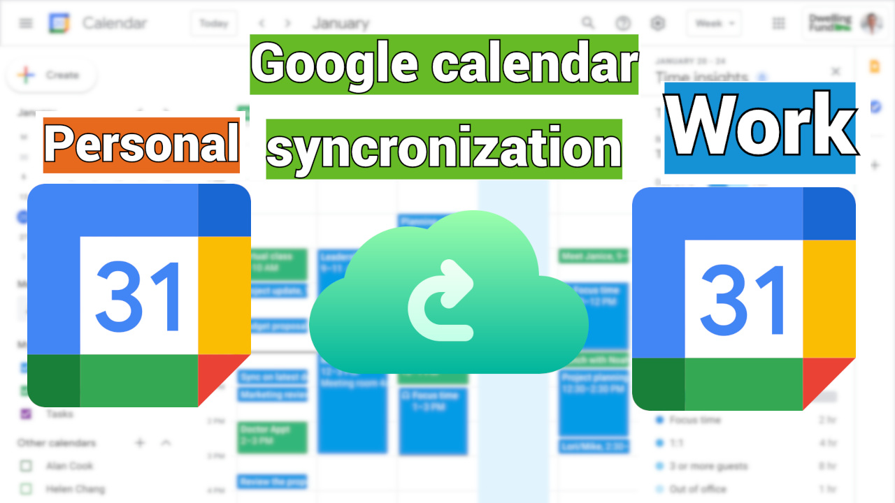
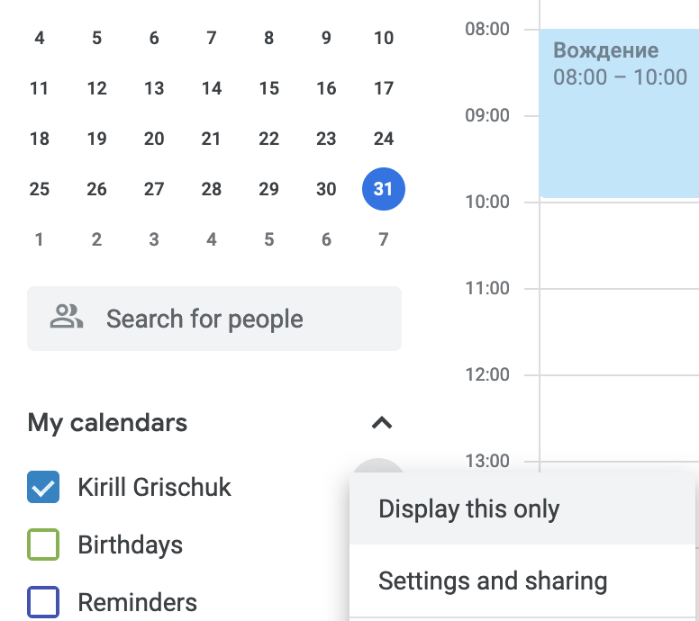
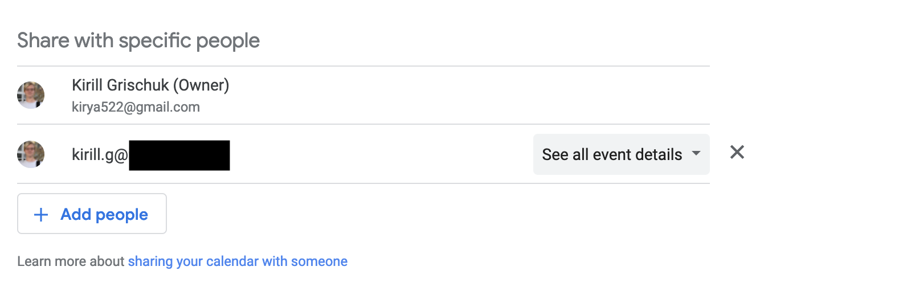
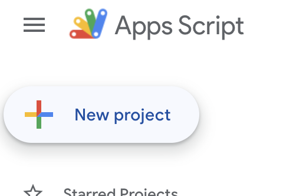
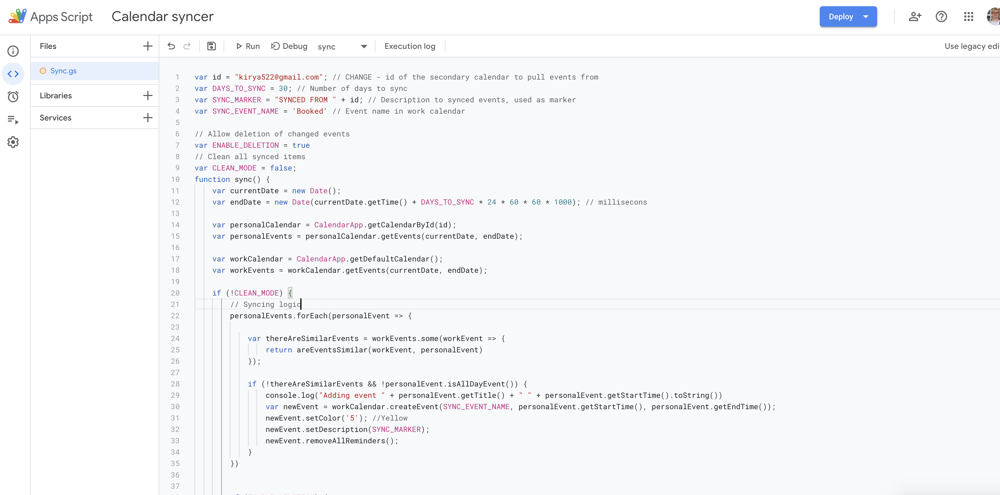
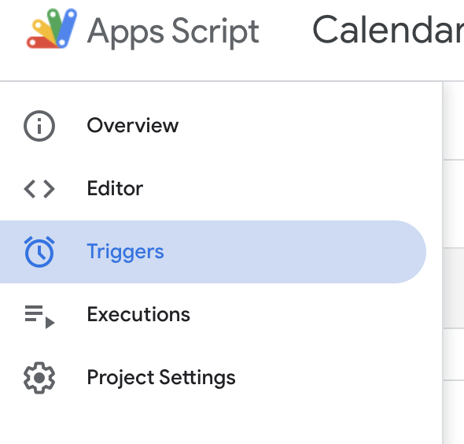
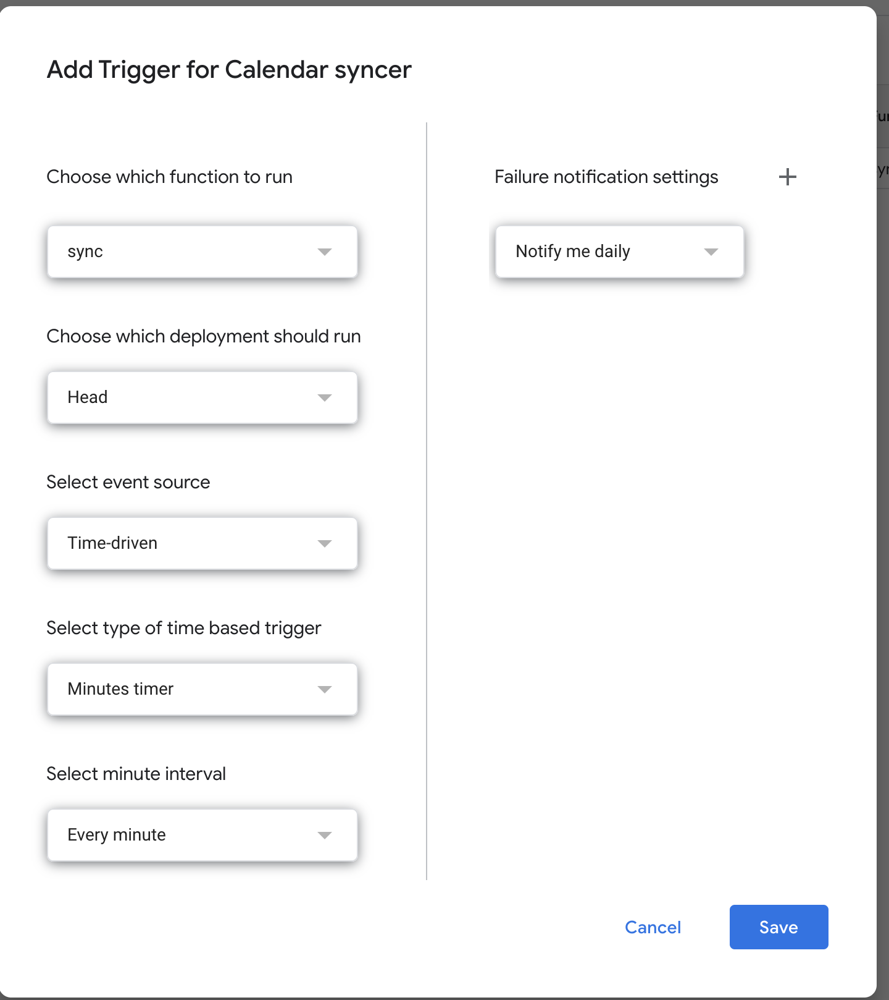

# Google calendar syncer
Source code for google script app to sync calendars.

 

---
[MEDIUM POST WITH DESCRIPTION](https://kirya522.medium.com/google-calendars-synchronization-c0e1971dbb49)

---
## Problem
You have two calendars
 - personal
 - work

and you need to sync timeslots in order to setup meetings in available time, currently there is no feature to add one google calendar to other without default event visibility, so I decided to create my own script in "Google Apps Script". 

## Requirements
1. Both of your callendars are google.
2. Install Google Apps Script app into your target(work) account [link](https://workspace.google.com/marketplace/app/google_apps_script/629453589428?pann=ogb) 
3. Shared personal calendar to work account

## Setup guide
1.  Install Google Apps Script app into your target(work) account [link](https://workspace.google.com/marketplace/app/google_apps_script/629453589428?pann=ogb) 
2.  Share your personal calendar to your work calendar via UI.   press "Settings and sharing" and after add your work account to share with specific people 
3. Create new Google Apps Script app in your work account [link](https://script.google.com/home) 
4. Copy content of src.js into newly created project file.   [link](https://script.google.com/home) 
5. Change id variable to your personal email, where you shared calendar from.  For example:
DO NOT FOREGET TO SAVE CHANGES WITH cmd/ctrl+S, or save button.
```js
var id = "kirya522@gmail.com"; // CHANGE - id of the secondary calendar to pull events from
```

6. Configure trigger to update your calendar.  Click on timer icon on the left.  
 
Click add trigger on the right bottom side and configure trigger to execute sync function each minute.   And press save.

 ### Thats it events from your personal calendar will sync each minute to your working calendar with specific name, you can change it using variable SYNC_EVENT_NAME 

---

 ## Submit PR if you want to fix or improve smth.